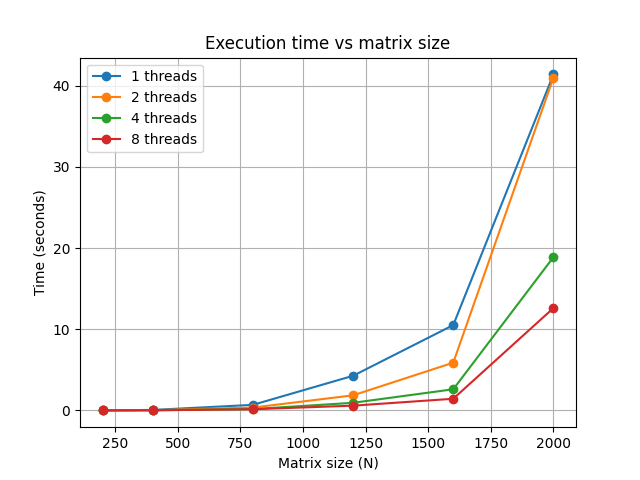
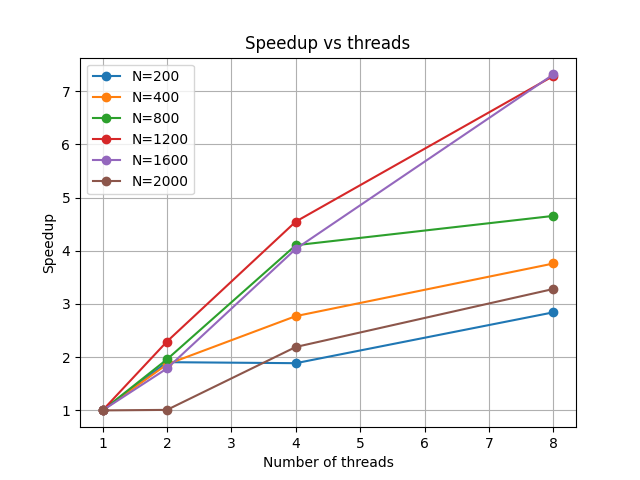

# Лабораторная работа №2: Параллельное перемножение матриц с использованием OpenMP

## Описание работы

В данной лабораторной работе реализована программа на языке C++, выполняющая перемножение квадратных матриц с использованием технологии параллельных вычислений OpenMP.

Цель работы — исследовать влияние параллелизации на производительность вычислений и оценить ускорение при использовании нескольких потоков.

---

## Цели и задачи

* Реализовать алгоритм перемножения матриц
* Модифицировать программу для параллельной работы с использованием OpenMP
* Провести серию экспериментов с различными:

  * размерами матриц
  * количеством потоков
* Проанализировать полученные результаты
* Построить графики зависимости времени и ускорения

---

## Используемые технологии

* Язык программирования: C++
* Параллелизация: OpenMP
* Построение графиков: Python + matplotlib

---

## Принцип работы программы

Программа выполняет следующие шаги:

1. Автоматически задаёт набор размеров матриц:

   * 200, 400, 800, 1200, 1600, 2000

2. Задаёт количество потоков:

   * 1, 2, 4, 8

3. Для каждой комбинации:

   * генерирует две случайные матрицы A и B
   * выполняет их перемножение
   * измеряет время выполнения

4. Результаты записываются в файл:

   * `results.csv`

---

## Параллелизация

Параллелизация выполнена с помощью директивы OpenMP:

```cpp
#pragma omp parallel for
```

Она применяется к внешнему циклу (по строкам матрицы):

```cpp
for (int i = 0; i < N; i++)
```

Это позволяет:

* распределить строки матрицы между потоками
* избежать гонок данных
* повысить производительность

---

## Проведение экспериментов

Были проведены вычисления для:

Размеры матриц:

* 200, 400, 800, 1200, 1600, 2000

Количество потоков:

* 1, 2, 4, 8

---

## Результаты

### Время выполнения



### Ускорение (Speedup)




---

## Выводы

* При увеличении числа потоков время выполнения уменьшается
* Ускорение не является линейным из-за накладных расходов на управление потоками
* На малых размерах матриц выигрыш от параллелизации невелик
* На больших размерах (800–2000) эффективность значительно выше
* Параллелизация по внешнему циклу позволяет избежать гонок данных

---

## Установка и запуск

### 1. Требования

* Компилятор C++ (MinGW / g++)
* Python 3
* matplotlib

---

### 2. Установка зависимостей

```bash
python -m pip install matplotlib
```

---

### 3. Компиляция программы

```bash
g++ main.cpp -O2 -fopenmp -o matrix_lab.exe
```

---

### 4. Запуск программы

```bash
./matrix_lab.exe
```

или (PowerShell):

```powershell
.\matrix_lab.exe
```

После выполнения создаётся файл:

```
results.csv
```

---

### 5. Построение графиков

```bash
python plot.py
```

Будут созданы:

* `time_plot.png`
* `speedup_plot.png`

---

## Структура проекта

```
main.cpp          — основной код программы
results.csv       — результаты экспериментов
plot.py           — построение графиков
time_plot.png     — график времени выполнения
speedup_plot.png  — график ускорения
README.md         — описание проекта
```

---

## Итог

В ходе работы была реализована параллельная версия алгоритма перемножения матриц с использованием OpenMP, проведены эксперименты и подтверждено, что параллелизация значительно ускоряет вычисления при увеличении размера задачи.
